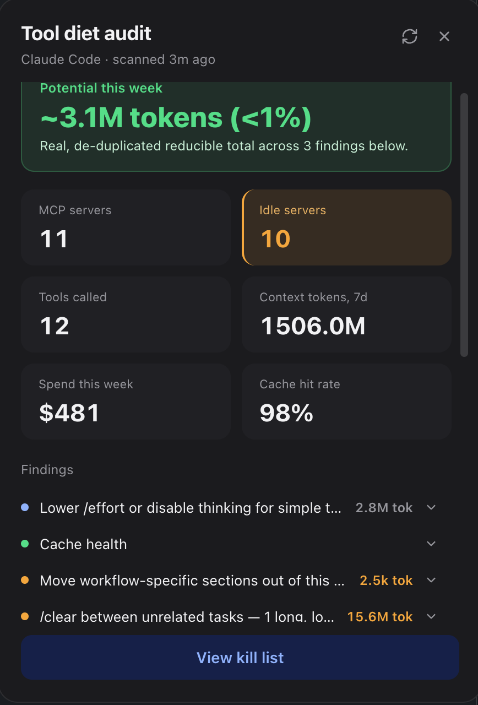

# Tool Diet Audit

A macOS edge-drawer that audits your local [Claude Code](https://claude.com/claude-code)
setup: which MCP servers you configured but never call, what you actually
spent, how healthy your prompt cache is, and where context is being wasted.

A thin handle docks to the right edge of your screen showing "N idle". Click
it to open a dashboard and drill into a server to see its real called tools.

<p align="center"></p>

Everything is computed **locally and read-only** from files Claude Code
already writes on your machine. See [Privacy](#privacy).

One line goes further than "here's your data": it names a real, computed
number — the average wasted tokens per session, from the same reducible pool
as the "Potential this week" banner — and asks whether that's normal for a
team your size. There's no comparison data behind that yet, so today
"Connect to find out" just opens a GitHub Discussion in your browser to
register interest; see [Connect (optional)](#connect-optional).

## Run it

Requires macOS, Node 18+, and Claude Code installed (the scan reads `~/.claude.json`).

```
npm install
npm run dev
```

Running from a VS Code or Cursor terminal is fine: those editors export
`ELECTRON_RUN_AS_NODE=1`, which makes Electron start as plain Node and crash
with a stack trace, so `npm run dev` and `npm run preview` clear it for you
(`env -u ELECTRON_RUN_AS_NODE`). If you launch Electron some other way, unset
it yourself.

Click the handle to expand. Click a server's usage bar to drill into its
called tools. Right-click the drawer to quit.

`npm run dist:mac` packages an **unsigned, unnotarized** arm64 `.app` (zipped)
into `release/`; `npm run dist:mac:intel` builds x64 for older Intel Macs. Since
it's unsigned, macOS Gatekeeper will require right-click → Open on first launch.

## Privacy

- Read-only. It never modifies your Claude Code config.
- No network access, and it never spawns or executes your configured MCP
  servers. (The MCP↔CLI redundancy check runs `command -v`, a local `$PATH`
  lookup.)
- It reads: `~/.claude.json`, each known project's `.mcp.json` and `CLAUDE.md`,
  installed plugin manifests under `~/.claude/plugins/`, and session logs under
  `~/.claude/projects/**/*.jsonl`. Nothing leaves the process except what the
  UI renders.
- The one exception is the "Connect" link described below — it's off by
  default in the sense that nothing happens until you click it, and even then
  it only opens a browser tab. It never uploads scan data.

## Connect (optional)

The dashboard's "Connect to find out" line opens
[a GitHub Discussion](https://github.com/matjaz-go/token-diet-tool/discussions/new?category=ideas)
in your default browser — nothing else. No scan data is sent, automatically
or otherwise; the app has no server to send it to. It exists to gauge whether
a real cross-team benchmark (e.g. "is 14k wasted tokens/session high for a
5-person team?") is worth building, and to let people register interest if
so. If that ships, it will be a separate, explicit opt-in — this tool's core
scan stays local-only regardless.

## What it shows, and what it deliberately doesn't

Claude Code defers unused tool schemas by default (tool search), and a
permission `deny` rule blocks *execution*, not context *loading*. So a claim
like "87 tools loaded, 19 used, 14k tokens wasted" can't be measured or
delivered honestly from local files. This app only reports numbers it can
actually derive:

| Screen | Shows | Intentionally absent |
|---|---|---|
| Dashboard | MCP servers configured, idle-server count, distinct tools actually called, context-token total for the window (from each session's `usage` block) | "Tools loaded" totals and used/loaded fractions — would require spawning each MCP server to introspect its schema (network + arbitrary code) |
| Drill-down | Real tool names and call counts, parsed from `tool_use` blocks in session logs; `alwaysLoad` misconfiguration flag | Names of idle tools that were never called — unknowable without introspecting the server |

The handle's badge is the number of idle *servers* found on the last scan.

### Three sources of "MCP server"

An MCP server can be available in a Claude Code session in three ways, each
with a different data quality:

| Source | Read from | Idle detection |
|---|---|---|
| `project` | `.mcp.json` / `~/.claude.json` → `projects[<path>].mcpServers` | High confidence: configured and zero calls |
| `plugin` | `~/.claude/plugins/installed_plugins.json`, cross-referenced with each plugin's own bundled `.mcp.json` for its real server name(s) | High confidence: installed and zero calls |
| `connector` | `~/.claude.json` → `claudeAiMcpEverConnected` (Slack, Gmail, Calendar, Drive, …) plus Chrome-extension flags | **Low confidence** — only knows "ever connected", never "currently connected", and only sees usage through Claude Code, not claude.ai web/mobile |

Any `mcp__<x>__<y>` tool call matching none of these still appears
(`source: 'unknown'`) rather than being dropped. Reading each plugin's own
manifest also surfaces redundancy for free, e.g. two installed plugins that
register the same underlying MCP server.

The connector blind spot is real: a connector used heavily from claude.ai's
web or mobile app looks idle here. That's why connectors get
`idleConfidence: 'low'`.

## Findings

Six checks run across every project Claude Code knows about, listed above the
server list on the dashboard:

| Finding | What it computes | Why |
|---|---|---|
| Cost & models | Weekly $ spend per model at list price; thinking-token share of output | The most tangible number |
| Cache health | `cache_read / (input + cache_read + cache_creation)`; warns under 50% on non-trivial sessions | A cost-per-token signal, not a token reduction |
| CLAUDE.md bloat | Per-project token cost of any CLAUDE.md over 200 lines, loaded into every session there | Move workflow-specific sections into skills |
| Long, low-activity sessions | Cost of sessions open 3h+ with under 2 turns/hour | `/clear` between unrelated tasks |
| Repeated file reads | Token cost of the same file read 3+ times in the window | Summarize or skill-ify the file |
| MCP ↔ CLI redundancy | A configured server (`github`, `vercel`, `stripe`, …) whose CLI is already on `$PATH` | Point CLAUDE.md at the CLI instead |

A headline **potential reduction** banner sums only what is genuinely
reducible and de-duplicated: `repeated-reads`, `claude-md-bloat`, and the
thinking share of `cost-breakdown`. `cache-health` and `long-sessions` have
real `impactTokens` but aren't reducible counts, so they're excluded (see
`computePotentialReduction` in `src/main/lib/checks.ts`). A percentage that
rounds to 0% shows as "<1%", never "0%".

The scan window is anchored to **local midnight** rather than a rolling
`sinceDays × 24h` (`windowCutoff` in `src/main/lib/fsPaths.ts`), so the
numbers hold steady across scans on the same day instead of drifting as old
sessions age out. Not ported: idle skills, hook coverage, daily cost trend,
costliest prompts, subagent usage, rate-limit hits.

Findings logic is adapted from `tool-diet`, the author's companion CLI, and
reimplemented locally so this app stays self-contained.

## How it's built

Electron + Vite (`electron-vite`) + React + TypeScript.

- `src/main/index.ts` — main process. Frameless, transparent, always-on-top
  `BrowserWindow` that resizes between a small handle and the full panel via
  IPC (`window:set-expanded`), always re-docked to the right edge of the
  primary display's work area. Also exposes `scan:run` and `connect:open`
  (opens a fixed GitHub Discussion URL via `shell.openExternal` — no argument
  accepted from the renderer, and no other network access).
- `src/main/realScan.ts` — orchestrates the scan.
- `src/main/lib/` — `fsPaths.ts` (path/window helpers), `pricing.ts` (model
  price table), `sessionAnalytics.ts` (session-log parsing), `format.ts`,
  `checks.ts` (the six findings and the headline reduction).
- `src/shared/types.ts` — `ScanResult`/`RealServer`/`Finding` shapes shared by
  main and renderer.
- `src/preload/index.ts` — exposes `window.toolDietBridge` via `contextBridge`.
- `src/renderer/src/` — the React UI; `App.tsx` owns view state
  (`idle | dashboard | drilldown`) and the scan result; `components/` has one
  file per screen.

Typecheck with `npx tsc --noEmit`. There is no test suite yet.

## Known limitations / roadmap

- The scan runs synchronously on the main thread. Fine on demand; move it
  off-thread before running it on a timer.
- Session logs are read three times (tool calls, session summaries, repeated
  reads). A single pass per file would be faster.
- Unsigned and unnotarized builds, no custom icon. Add an `.icns`, an Apple
  Developer ID and notarization (`electron-builder` `afterSign`) before wider
  distribution.
- macOS only. It depends on the Claude Code file layout under `~/.claude`,
  which is not a stable public interface and may change.

## License

[MIT](LICENSE)
